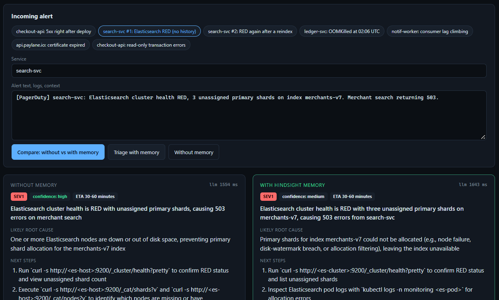
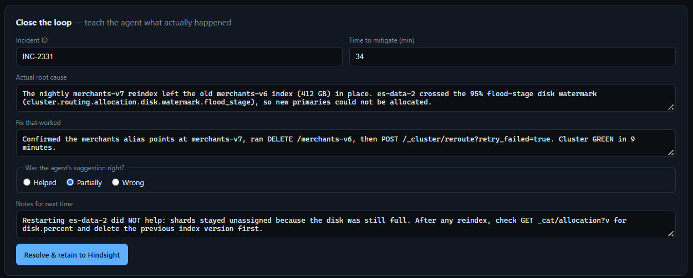
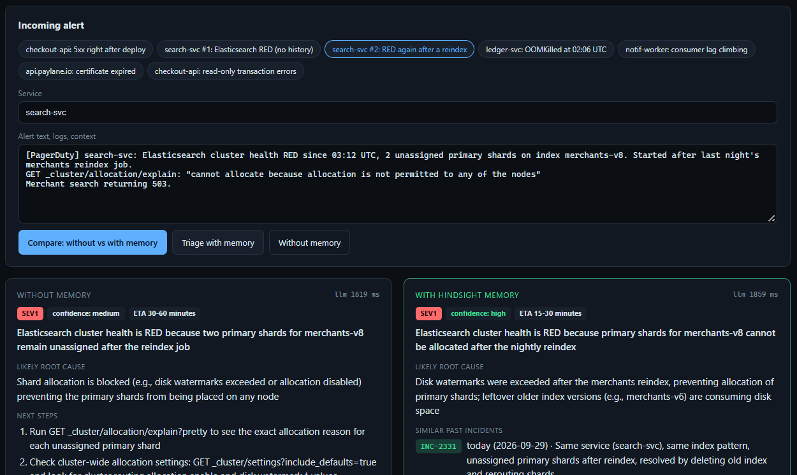
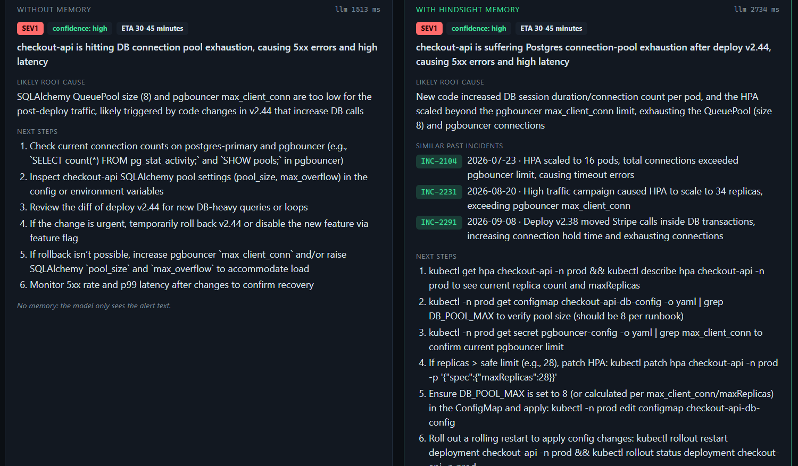

# Paylane On-call: an incident agent that remembers every outage

**An incident-response agent that gets more experienced every time an incident is closed, because its memory lives in [Hindsight](https://github.com/vectorize-io/hindsight).**

**Live demo:** [hindsight-incident-agent-9db9.onrender.com](https://hindsight-incident-agent-9db9.onrender.com). It runs on a free server that sleeps when idle, so the first load can take about a minute.


## The problem

When production breaks at 3am, the fix is usually sitting in a post-mortem nobody re-reads. On-call engineers rediscover the same root causes, and repeat the same tempting-but-wrong fixes, because the knowledge lives in old tickets and in the heads of whoever was on call last time.

A plain LLM doesn't help much here. It gives the textbook answer every time, with no idea that the textbook answer made last month's outage worse.

## The solution

When an alert fires, the agent **recalls** similar past incidents from Hindsight, **reasons** over them with an LLM, and **recommends** concrete next steps. The recommendation cites incident IDs and includes an explicit *do-not-repeat* list. When the engineer resolves the incident, the real root cause, the fix, and a verdict on the agent's own advice are **retained** back into Hindsight. The next similar alert benefits from it.

```
INCIDENT → RECALL → REASON → RECOMMEND → RESOLVE → RETAIN → (next incident is better)
```

## Why memory matters

The same alert goes to the same model (`openai/gpt-oss-120b` on Groq) with the same prompt skeleton. The only variable is whether Hindsight recall is switched on. **Compare** mode runs both side by side.

Observed in live runs on 2026-09-29 for the flagship alert, *checkout-api: 5xx right after deploy* (LLM wording varies between runs; the substance below held across repeated runs):

| | Without memory | With Hindsight memory |
|---|---|---|
| Past incidents cited | none | **INC-2291** (same errors right after a deploy), INC-2104, INC-2231 |
| Diagnosis | Pool too small or a connection leak | The new release holds DB connections longer (e.g. outbound calls inside transactions), the INC-2291 pattern |
| Do not repeat | *(empty)* | Increasing `DB_POOL_MAX` (made exhaustion worse in INC-2291); rolling restart (worsened INC-2104) |

For the cold-start pair, the first Elasticsearch alert recalls nothing relevant and gets generic steps. After INC-2331 is resolved and retained, the second alert recalls it, cites it, and starts with `GET _cat/allocation?v` to check disk usage. The full evidence log is in [`docs/live-verification.md`](docs/live-verification.md).

## Screenshots (live run)

| 1. A failure type it has never seen | 2. Engineer closes the loop |
|---|---|
|  |  |
| **3. Next similar alert: recalls INC-2331** | **4. Deep history: same model, with and without memory** |
|  |  |

## How Hindsight is used

All Hindsight calls are in [`app/memory.py`](app/memory.py) and use the official [`hindsight-client`](https://pypi.org/project/hindsight-client/) Python SDK (verified against v0.10.1).

| Operation | Where | What it does |
|---|---|---|
| `create_bank` | on startup | One bank (`paylane-oncall`) with an ops-focused `mission` and `retain_custom_instructions`: keep exact error strings verbatim, and always record whether a fix worked. |
| `retain` | `scripts/seed.py` | Loads 19 past post-mortems, each with `timestamp` set to when it happened, `document_id` = incident ID, and `tags=["service:<name>", "kind:incident"]`. |
| `recall` | every triage | Two passes: first scoped by `tags=["service:<name>"]`, then bank-wide, then de-duplicated. Cross-service causes (a Patroni failover surfacing as checkout errors) are the ones people forget. |
| `retain` | **Close the loop** form | The resolution goes back into memory: real root cause, fix, time to mitigate, and a verdict on the agent's own advice (*helped / partial / wrong*). A wrong suggestion is remembered as wrong. |
| `reflect` | **Learned playbook** tab | Hindsight reasons over the whole bank and writes a per-service playbook: recurring failures, proven fixes, and traps, with incident IDs cited. |

**Stored:** symptoms, exact error strings, service, root cause, failed remediations, the fix that worked, time to mitigate, follow-ups, and the verdict on the agent's advice.
**Not stored:** API keys, credentials, customer data, full raw log dumps, or the agent's unverified guesses. Only engineer-confirmed outcomes are retained.

## Features

- **Compare mode.** Without-memory and with-memory triage run in parallel on the same model, side by side.
- **Structured triage.** Severity, likely root cause, confidence, similar incidents (with IDs and dates), ordered next steps, a do-not-repeat list, and an ETA.
- **Transparent recall.** Every with-memory card expands to show exactly what Hindsight returned and how long recall took.
- **Close the loop.** Resolving an incident retains it immediately, and a *Memory updated* panel shows the exact text stored.
- **Learned playbook.** `reflect` over the whole bank, regenerated on demand.
- **Memory explorer.** Run raw `recall` queries against the bank.
- **Honest when memory is empty.** The prompt distinguishes *disabled*, *nothing recalled* and *N memories*, and forbids invented incident IDs.

## Demo flow

**A. Learning from zero (cold start).** This shows the whole loop, starting with nothing.

1. Click **search-svc #1: Elasticsearch RED (no history)** → **Compare**. Neither column has relevant history, and the memory column says so.
2. The **Close the loop** form pre-fills with the real outcome (INC-2331: the reindex left the old index behind, so the disk crossed flood-stage). Click **Resolve & retain**. The **Memory updated** panel shows what was stored.
3. Click **search-svc #2: RED again after a reindex** → **Compare**. The memory column now recalls INC-2331 and warns that restarting the data node didn't help.

**B. Deep history (the flagship before/after).**

4. **checkout-api: 5xx right after deploy** → **Compare**. The generic column blames pool size and has nothing to avoid; the memory column cites INC-2291 and warns that raising `DB_POOL_MAX` made it worse.
5. **notif-worker: consumer lag climbing**. Memory knows skipping offsets was the *wrong* call in INC-2302.
6. **Learned playbook** → **Generate**. The newly retained INC-2331 lesson appears alongside the older ones.

A full walkthrough with narration is in [`content/video-script.md`](content/video-script.md).

## Installation

Needs Python 3.11+, a [Hindsight Cloud](https://ui.hindsight.vectorize.io) API key (or a [self-hosted Hindsight](https://github.com/vectorize-io/hindsight) server), and a [Groq](https://console.groq.com/keys) API key.

```bash
python -m venv .venv
.venv/Scripts/pip install -r requirements.txt     # macOS/Linux: .venv/bin/pip
cp .env.example .env                               # then fill in the keys
```

## Environment variables

| Variable | Required | Default | Notes |
|---|---|---|---|
| `HINDSIGHT_BASE_URL` | no | `https://api.hindsight.vectorize.io` | Use `http://localhost:8888` for a local server |
| `HINDSIGHT_API_KEY` | for Cloud | none | From the Hindsight Cloud dashboard |
| `HINDSIGHT_BANK_ID` | no | `paylane-oncall` | Memory bank name |
| `GROQ_API_KEY` | yes | none | |
| `GROQ_MODEL` | no | `openai/gpt-oss-120b` | Any Groq chat model |
| `GROQ_FALLBACK_MODEL` | no | `openai/gpt-oss-20b` | Used after two failures of the primary, or at once on a rate limit |
| `APP_PASSWORD` | on public hosts | none | Every page asks for this password (any username). Set it whenever the app is reachable from the internet |

Keys are read from the environment only. `.env` is git-ignored, and nothing is hard-coded.

## Running locally

```bash
python -m scripts.seed --reset      # (re)create the bank and retain the 19 historical incidents
uvicorn app.main:app --reload       # open http://localhost:8000
```

`--reset` deletes the bank first, so run it before each demo recording to start from a known state.

Tests run fully offline (Hindsight and Groq are replaced with fakes):

```bash
python -m pytest -q
```

They cover incident formatting, JSON parsing and repair, retain, scoped recall, empty recall, a Hindsight outage (502), LLM retry, fallback and rate limits, missing configuration, input validation, the password gate, the API endpoints, and an end-to-end *incident → recall → recommend → retain → improved recall* loop.

To check against the real services (reseeds the bank, then runs cold start → retain → recall):

```bash
python -m scripts.verify_live
```

## Deploying (Render)

[`render.yaml`](render.yaml) describes the service. On [Render](https://render.com), choose **New → Blueprint** and select this repository. Render then asks for `HINDSIGHT_API_KEY`, `GROQ_API_KEY` and `APP_PASSWORD`, and stores them itself; they are never committed.

The free plan sleeps after about 15 minutes idle, so the first request after a pause takes up to a minute. Memory lives in Hindsight, not on the server, so nothing is lost when it sleeps. To reset the demo state, run `python -m scripts.seed --reset` from any machine with the same `.env`.

## Example incident

From `data/incidents.json` (19 incidents across 8 services):

```
INC-2291 (SEV1) checkout-api: Checkout outage after deploy v2.38
Alert: checkout-api 5xx 22%, p99 latency 7.4s, started 3 minutes after deploy v2.38
Logs: sqlalchemy.exc.TimeoutError: QueuePool limit of size 8 overflow 0 reached ...
Root cause: v2.38 moved the Stripe PaymentIntent call inside the DB transaction ...
Tried but did NOT help: Raising DB_POOL_MAX to 16 (made it worse); Rolling restart of pods
Fix that worked: argocd app rollback checkout-api. Errors cleared in 6 minutes.
```

## Technology stack

| Layer | Choice | Why |
|---|---|---|
| Memory | Hindsight (`hindsight-client`) | retain / recall / reflect with tags, timestamps, bank missions |
| LLM | Groq, `openai/gpt-oss-120b`, falling back to `openai/gpt-oss-20b` | Fast, JSON mode, configurable via env |
| API | FastAPI + Pydantic | Input validation, small surface |
| UI | Plain HTML/CSS/JS | No build step |
| Tests | pytest + FastAPI TestClient | Offline fakes for Hindsight and Groq |

## Project structure

```
app/
  memory.py    Hindsight bank: mission, retain (incidents + resolutions), scoped recall, reflect
  agent.py     prompt, JSON triage schema, memory on/off, JSON repair retry
  llm.py       Groq client: timeout, retry, fallback model
  main.py      FastAPI: /api/triage, /api/resolve, /api/playbook, /api/memories, /api/health
  config.py    environment settings + missing-config check
data/
  incidents.json    19 synthetic post-mortems across 8 services, with recurring patterns
  demo_alerts.json  demo alerts, including a cold-start pair with a scripted resolution
scripts/seed.py     retains the history with relative timestamps ("3 weeks ago" stays true)
static/             single-page ops console
tests/              23 offline tests
docs/               architecture diagram, submission notes
content/            article, social post, video script
```

## Limitations

- **The incident history is synthetic.** It is 19 post-mortems written to be realistic and internally consistent for a fictional payments company ("Paylane"). There is no connector to PagerDuty, Jira, or a real post-mortem store yet.
- **No measured impact.** There are no MTTR or accuracy numbers. The before/after is qualitative, and LLM output varies between runs.
- **No authentication or multi-tenancy.** Anyone who can reach the server can triage, retain, and read the bank. Don't expose it publicly as-is.
- **Retained resolutions are trusted.** Whatever an engineer submits becomes memory. There's no review step.
- **Recall quality depends on Hindsight's extraction.** Alerts with very little text recall less well.

## Future improvements

- Ingest resolved incidents automatically from PagerDuty, Opsgenie, or Jira webhooks.
- Post triage into the incident Slack channel, and resolve from there.
- Measure recommendation hit-rate from the *helped / partial / wrong* verdicts over time.
- Per-team banks, with auth.
- Pull live context (recent deploys, config diffs) alongside recalled memory.

## Hindsight references

- [Hindsight on GitHub](https://github.com/vectorize-io/hindsight)
- [Hindsight documentation](https://hindsight.vectorize.io/)
- [Hindsight Cloud API integration](https://docs.hindsight.vectorize.io/api-integration/)
- [What is agent memory? (Vectorize)](https://vectorize.io/what-is-agent-memory)

## Credits

Built by Brahmini sai Bandi, Akshitha Yaddu, Neha Jetta, Shravani Thouta, Kasarla Adithya and V Arjun. Memory by [Hindsight](https://github.com/vectorize-io/hindsight) from Vectorize, inference by [Groq](https://groq.com/).

## License

MIT, see [LICENSE](LICENSE).
