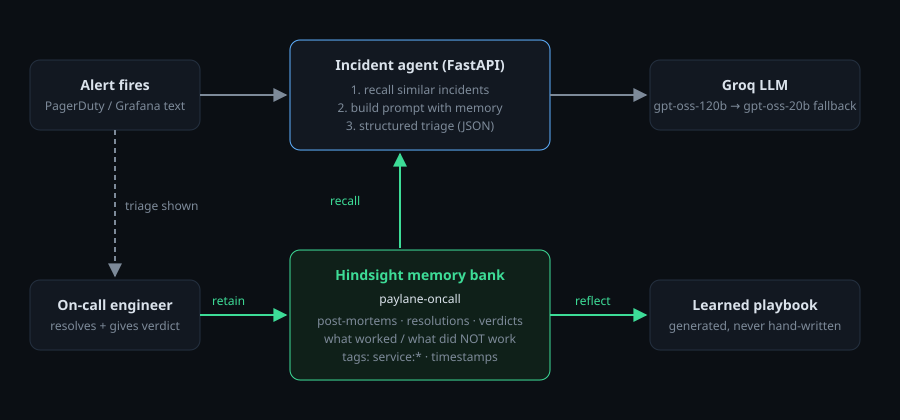

# My incident agent remembers the fixes that made things worse

The worst advice an on-call assistant can give is the advice that sounds right. "Connection pool exhausted? Increase the pool size and restart the pods." Every LLM will tell you that. On our checkout service, three weeks earlier, that exact advice turned a 6-minute rollback into a 26-minute outage.

So I built an incident response agent whose most important feature is not what it knows but what it remembers: every past incident, every fix that worked, and, more importantly, every fix that didn't.

## What the system does

The agent sits between the alert and the engineer. An alert fires (PagerDuty text, a Grafana panel, a handful of log lines), and the agent returns a structured triage: severity, likely root cause, similar past incidents with dates, ordered next steps, and an explicit **"do not repeat"** list.

The stack is intentionally small:

- **FastAPI** backend with four endpoints: triage, resolve, playbook, recall.
- **Groq** running `openai/gpt-oss-120b`, with `qwen/qwen3-32b` as a fallback.
- **[Hindsight agent memory](https://github.com/vectorize-io/hindsight)** as the only source of institutional knowledge.
- A single-page ops console with no build step.

There's no vector database I manage, no embedding pipeline, and no chunking code. The agent's whole memory lives in one Hindsight bank, and the application code only ever calls `retain`, `recall` and `reflect`.



## The core idea: failed fixes are first-class data

Most "RAG over post-mortems" projects retrieve the *resolution*. That misses the point. In a real incident, the expensive mistakes are the tempting steps that don't work: restarting pods that reconnect-storm the database, skipping a Kafka offset when the real problem is a rebalance storm, raising a memory limit that only buys one more night.

So when I designed the memory bank, I made "what did NOT work" as prominent as the fix. The bank is created with a mission that tells Hindsight what matters in this domain:

```python
BANK_MISSION = (
    "You are the institutional memory of the Paylane on-call team (a payments platform). "
    "Remember every production incident: the symptoms and exact error strings, the affected "
    "service, the root cause, which fixes worked, which fixes were tried and did NOT work, "
    "how long mitigation took, and any follow-up actions. Prefer precise, operational facts."
)

self.client.create_bank(
    bank_id=self.bank_id,
    name="Paylane on-call memory",
    mission=BANK_MISSION,
    retain_custom_instructions=RETAIN_INSTRUCTIONS,  # keep error strings verbatim
    enable_observations=True,
)
```

The retain instructions are short but they matter: *keep exact error messages, metric names, versions and commands verbatim, and always record whether a remediation worked or failed.* An alert like `QueuePool limit of size 8 overflow 0 reached` is a fingerprint. If memory paraphrases it into "database issues", recall gets vague and the agent becomes generic again.

Each post-mortem is retained as one document, timestamped at the date it actually happened and tagged by service:

```python
self.client.retain(
    bank_id=self.bank_id,
    content=format_incident(incident),
    timestamp=_parse_ts(incident.get("occurred_at")),
    context=f"post-mortem for {incident['id']} ({incident['service']})",
    document_id=incident["id"],
    metadata={"service": incident["service"], "severity": incident.get("severity", "")},
    tags=[f"service:{incident['service']}", "kind:incident"],
)
```

The timestamp is what lets the agent say "this happened three weeks ago" instead of just "this happened". In an incident channel, recency changes how much you trust a precedent.

## Recall: scoped first, then wide

My first version recalled only from the alerting service. It worked on the easy cases and failed on the interesting one: `cannot execute INSERT in a read-only transaction` on checkout-api. The real history for that error lives under **postgres-primary**. A Patroni failover moved the leader, and pgbouncer was still pointed at the old primary's IP.

Humans miss that link too. So recall is now two-pass: first scoped to the service tag, then across the whole bank, de-duplicated:

```python
scopes = [[f"service:{service}"], None] if service else [None]
for tags in scopes:
    resp = self.client.recall(
        bank_id=self.bank_id, query=query, max_tokens=max_tokens,
        budget="mid", tags=tags, tags_match="any",
    )
    for r in resp.results or []:
        if r.id not in seen:
            seen[r.id] = Memory(id=r.id, text=r.text, type=r.type,
                                when=r.occurred_start or r.mentioned_at,
                                document_id=r.document_id, tags=list(r.tags or []))
```

The service-scoped pass puts the most specific history first in the prompt, and the wide pass catches the cross-service causes. That ordering turned out to matter more than any prompt tweak I made.

## Closing the loop: the agent grades itself

Retrieval alone gives you a smart search box. What makes it an agent that learns is the resolve step. When an engineer closes an incident, they record the actual root cause, the fix, time to mitigate, and a verdict on the agent's own suggestion: *helped*, *partial* or *wrong*. That verdict goes straight back into [Hindsight](https://hindsight.vectorize.io/):

```python
verdict = {
    "helped": "The agent's triage suggestion WORKED and led to the fix.",
    "partial": "The agent's triage suggestion was PARTIALLY right.",
    "wrong": "The agent's triage suggestion was WRONG and did not help.",
}.get(resolution.get("suggestion_verdict", ""), "")
```

The system prompt then has one rule that only makes sense with memory: *if memory says a previous agent suggestion was wrong, do not repeat it.* Without persistent memory, a stateless LLM will confidently make the same wrong call forever. With it, a wrong answer is a one-time cost.

## What it looks like

The console has a **Compare** button that runs the same alert through the same model twice in parallel: once with memory disabled, once with Hindsight recall. Here is the alert:

> checkout-api 5xx rate 17%, p99 latency 6.8s. Started 4 minutes after deploy v2.44.
> `sqlalchemy.exc.TimeoutError: QueuePool limit of size 8 overflow 0 reached`
> `pgbouncer: no more connections allowed (max_client_conn)`

**Without memory**, the model sees a pool error and says what everyone says: the pool is too small for traffic, so increase `DB_POOL_MAX`, restart the pods, and check pgbouncer stats. Confidence: medium. ETA: 30 to 60 minutes.

**With memory**, it recalls INC-2291 from three weeks earlier: identical errors a few minutes after a deploy. In that incident a release had moved a Stripe call inside a DB transaction, so every checkout held a connection for the full round trip. Raising `DB_POOL_MAX` saturated pgbouncer faster, and a rolling restart didn't help. `argocd app rollback` fixed it in six minutes. So the triage becomes: roll back v2.44 first, then diff it for outbound HTTP inside DB sessions. Its do-not-repeat list reads "raising DB_POOL_MAX (made INC-2291 worse)" and "rolling restart (INC-2104)".

The two runs use the same model and the same prompt skeleton, and the only difference between them is what Hindsight recalled.

Two other cases convinced me the design was right:

- **Kafka lag on notif-worker.** A naive read of the history says "poison message, skip the offset" (INC-2118). But INC-2302 had the same symptom and skipping offsets was the *wrong* call. The real cause was a rebalance storm from slow SMS calls, and the skip lost two thousand notifications. Because the logs mention `Revoking previously assigned partitions` and an empty DLQ, the agent picks the right precedent and warns against the wrong one.
- **An Elasticsearch cluster going red**, which we've never seen before. Recall returns nothing relevant and the agent says so plainly. I spent real time on this. The prompt separates "memory disabled", "nothing recalled" and "N memories recalled", and forbids inventing incident IDs. An agent that fabricates history is worse than one with none.

## The playbook nobody writes

The last piece uses `reflect`. The **Learned playbook** tab asks Hindsight to reason over everything in the bank and produce, per service, the recurring failure patterns, the fastest proven fix, and the fixes that look tempting but haven't worked. It cites incident IDs.

Nobody maintains this document. It changes every time an incident is resolved. The ledger-svc section, for example, will tell you that nightly OOMs at 02:00 UTC mean `RECON_BATCH_SIZE` went missing (INC-2133, then again in INC-2280 after a helm values refactor), and that raising the memory limit has failed twice. That is exactly the note you'd want a senior engineer to leave you, and here the memory writes it.

## Lessons learned

1. **Retain the failures, not just the fixes.** The "avoid" list is where most of the value is. If your post-mortem template doesn't have a "tried, didn't help" field, add one before you add an AI.
2. **Tell the memory what matters.** A domain-specific bank mission and "keep error strings verbatim" did more for recall quality than any retrieval tuning. Hindsight's extraction is good, but it needs to know that `max_client_conn` is a fingerprint and not noise.
3. **Timestamps are part of the answer.** "Three weeks ago" and "it happened twice" change how an engineer weighs a precedent. Retain with real event times.
4. **Scope, then widen.** Tag-scoped recall gives precision; a second bank-wide pass catches the cross-service root causes that people miss.
5. **Make the agent's mistakes part of its memory.** A *wrong* verdict retained next to the incident is the cheapest improvement you can make to an agent. It's also impossible without persistent memory, which is why I think [agent memory](https://vectorize.io/what-is-agent-memory) is the actual product here and the LLM is the replaceable part.

The model will get swapped out many times. The memory bank, with every outage and every bad call in it, is the part worth protecting.

*The code, including the incident dataset and the offline test suite, is on GitHub: [link to your repo].*
